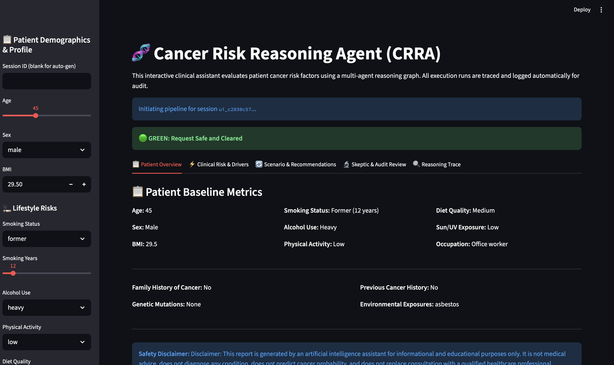
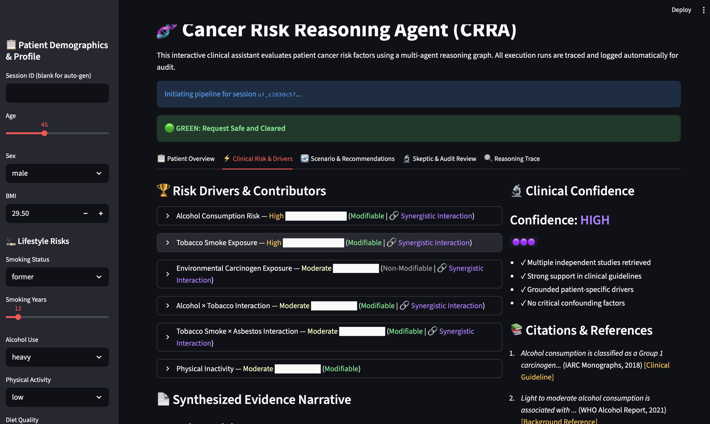
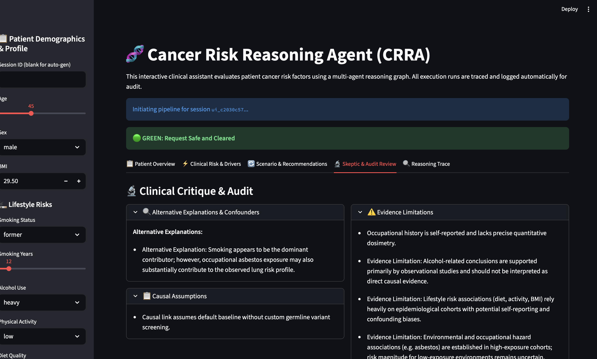

# 🧬 CRRA: Cancer Risk Reasoning Agent

> **An explainable multi-agent AI platform for personalized cancer risk reasoning through evidence synthesis, causal analysis, counterfactual simulation, and clinical critique.**

---

## Overview

Cancer risk assessment is often presented as a single prediction or score, leaving clinicians and patients with little visibility into **why** a conclusion was reached. CRRA addresses this challenge by replacing opaque predictions with a transparent, evidence-driven reasoning pipeline.

Rather than functioning as a diagnostic tool, CRRA acts as an **AI-powered clinical decision support prototype** that coordinates multiple specialized agents to retrieve evidence, analyze risk factors, identify causal contributors, simulate lifestyle interventions, critique its own reasoning, and generate an explainable report.

The project was developed as part of Kaggle's **AI Agents: Intensive Vibe Coding Capstone** and demonstrates how multi-agent systems can improve transparency, reasoning quality, and user trust in healthcare AI.

---


## 🎥 Demo

**Video Demonstration:** https://youtu.be/K5jlOviWGM8


## 📸 System Demo

### Patient Overview


### Clinical Risk & Drivers


### Scenario Recommendations


### Skeptic Audit Review



## Problem Statement

Cancer risk is influenced by numerous interacting factors, including genetics, lifestyle, environmental exposure, and previous medical history.

Most existing AI systems present only a final prediction while hiding the reasoning process. This creates several challenges:

* Limited explainability
* Poor user trust
* Difficulty validating evidence
* Lack of actionable recommendations
* Minimal uncertainty awareness

Healthcare professionals require systems that explain **how** conclusions were reached—not just **what** the conclusion is.

CRRA was designed to address these challenges.

---

## Solution

CRRA is an explainable multi-agent reasoning platform that decomposes cancer risk analysis into specialized reasoning stages.

Instead of relying on a single monolithic model, independent agents collaborate to:

* validate patient inputs
* retrieve supporting clinical evidence
* identify evidence-backed risk factors
* prioritize causal contributors
* detect synergistic interactions
* generate personalized counterfactual scenarios
* critique reasoning through an independent Skeptic Agent
* estimate reasoning confidence
* synthesize an explainable clinical report

The result is a transparent reasoning workflow that allows users to inspect every major decision made by the system.

---

## Key Features

* Multi-agent clinical reasoning architecture
* Retrieval-Augmented Generation (RAG) evidence layer
* Evidence quality ranking
* Risk interaction detection
* Patient-specific counterfactual recommendations
* Independent Skeptic Agent
* Dynamic confidence scoring
* Explainable reasoning trace
* Interactive Streamlit dashboard
* 128 automated tests
* Technical audit and benchmarking framework

---

## System Architecture

```text
                     Patient Profile
                            │
                            ▼
                  Orchestrator Agent
                 (Workflow Controller)
                            │
                            ▼
                    Workflow Graph
                            │
                            ▼
                    Security Agent
                            │
                            ▼
                    Evidence Agent
          (RAG, Evidence Ranking & Interactions)
                            │
                            ▼
                    Causality Agent
                (Risk Prioritization & Attribution)
                     ┌────────┴────────┐
                     ▼                 ▼
         Counterfactual Agent    Skeptic Agent
         (What-if Analysis)   (Critical Review)
                     └────────┬────────┘
                              ▼
                     Synthesis Agent
              (Clinical Report Generation)
                              │
                              ▼
               Explainable Clinical Report
                              │
                              ▼
                    Streamlit Dashboard
```

The platform follows a **workflow-driven orchestration architecture**. The `OrchestratorAgent` serves as the entry point, initializing the workflow state and delegating execution to the `WorkflowGraph`, which coordinates the ordered execution of specialized reasoning agents. Each agent performs a single responsibility, while dedicated reasoning tools (such as retrieval, evidence ranking, interaction detection, risk attribution, confidence scoring, and clinical questioning) provide reusable capabilities that support the agents without introducing unnecessary coupling.

---

## Technology Stack

* Python
* Streamlit
* ChromaDB
* Pydantic
* Retrieval-Augmented Generation (RAG) -(Local Embedded Mode)
* Modular Multi-Agent Architecture
* Workflow-based Orchestration
* Evidence Ranking
* Counterfactual Reasoning
* Execution - Fully Local(No Cloud AI APIs Required)

---

##  Local-First & Privacy-Focused

CRRA is designed as a fully local, privacy-preserving clinical reasoning prototype.

CRRA executes its complete multi-agent workflow locally without transmitting patient information to third-party APIs.

- **No API Keys Required:** No OpenAI, Anthropic, Gemini, or other cloud AI services are needed.
- **Privacy-Preserving:** Patient information and reasoning traces remain on the local machine.
- **Offline Execution:** The workflow engine, reasoning agents, ChromaDB vector store, and evaluation framework operate locally once installed.
- **Reproducible:** Results can be reproduced without dependence on external hosted services.

## Repository Structure

```agents/          # Specialized reasoning agents
tools/           # Reusable reasoning utilities
workflows/       # Workflow orchestration
schemas/         # Shared data contracts
evaluation/      # Benchmarks and evaluation
tests/           # Automated tests
docs/            # Technical documentation
app.py           # Streamlit application
```

---

## Installation

```bash
git clone <repository-url>

cd cancer-risk-reasoning-agent

pip install -r requirements.txt

streamlit run app.py
```

---

## Testing

Run the complete test suite:

```bash
pytest
```

Current status:

* 128/128 tests passing

---


## Project Highlights

* Transparent reasoning instead of black-box prediction
* Evidence-backed risk analysis
* Explicit uncertainty reporting
* Independent clinical critique
* Explainable AI workflow
* Modular architecture suitable for future extension

---

## Limitations

CRRA is a research prototype and educational decision-support system.

It **does not diagnose cancer**, estimate individualized clinical probabilities, or replace professional medical advice.

The platform is intended to demonstrate explainable AI agent architectures for clinical reasoning rather than provide medical diagnoses.

---

## Future Work

* Integration with live biomedical literature APIs
* Clinical guideline synchronization
* Longitudinal patient monitoring
* Probabilistic causal modeling
* Cloud deployment
* Electronic Health Record (EHR) integration

---

## Acknowledgements

Developed for the Kaggle **AI Agents: Intensive Vibe Coding Capstone**.

The project was built through an iterative AI-assisted engineering workflow using Antigravity for implementation planning, code refinement, testing support, architectural review, and documentation, while all design decisions and final validation were performed by the project author.
#