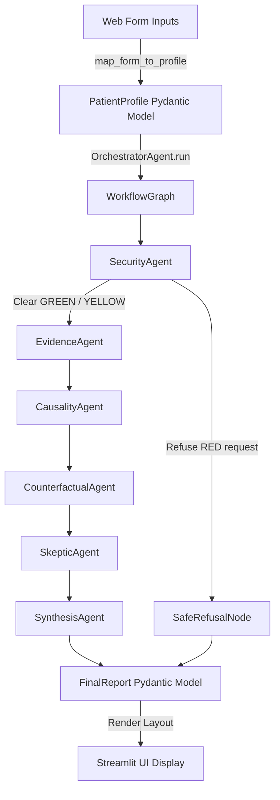

# Stage 19 — Web User Interface

CRRA includes a web-based interactive interface powered by [Streamlit](https://streamlit.io). It allows clinicians and users to input patient profiles, run the complete multi-agent reasoning chain, and view structured reports with evidence summaries, citations, risk contributors, counterfactual what-if scenarios, and critical skeptic audits.

## Launching the Web Application

To launch the Streamlit UI locally, ensure your environment is active and run the following command from the workspace root:

```bash
streamlit run app.py
```

Streamlit will boot a local development web server and automatically open the application in your default browser (usually at `http://localhost:8501`).

---

## UI Architecture & Execution Flow

The web interface is designed as a thin presentation layer. It does not perform reasoning or report formatting internally. Instead, it translates inputs to a `PatientProfile`, forwards it to the orchestrator, and presents the resulting `FinalReport`.



---

## Safety Routing Logic

The application respects the three tier safety routing scheme:
1. **GREEN (Approved)**: Executes all reasoning agents and displays the full clinical findings alongside a green check status.
2. **YELLOW (Warning)**: Executes all clinical reasoning agents but flags a warning banner clarifying that the generated content is purely educational and not diagnostic.
3. **RED (Blocked)**: Bypasses the evidence and reasoning graph entirely. Renders a prominent warning and returns the safety refusal report containing only the clinical disclaimer.

---

## Sample UI Mock Layouts

### 1. Main Entrypoint & Form
The sidebar contains all input fields mapping to `PatientProfile`:
- Demographic inputs (Age, Sex, BMI)
- Lifestyle risks (Smoking status & years, Alcohol, Physical Activity, Diet, Sun exposure)
- Medical and occupational history (Occupation, Environmental exposure, Genetic mutations, family history, personal cancer history)

### 2. Standard Safe Output (GREEN)
Renders a two-column response containing:
- **Top Risk Contributors**: Ranked factors
- **Evidence Summary**: Scientific explanation
- **Counterfactual Scenarios**: Expected outcomes of modifying lifestyle habits
- **Confidence Rating**: (High/Medium/Low)
- **Citations**: Detailed sources
- **Clinical Limitations**: Uncovered skeptic audits

### 3. Refused Request Output (RED)
Renders an error banner blocking clinical modules:
> 🚨 **RED Warning: Clinical Safety Route Triggered**
> *This request has been blocked because it violates system guidelines or contains potential prompt injections.*
